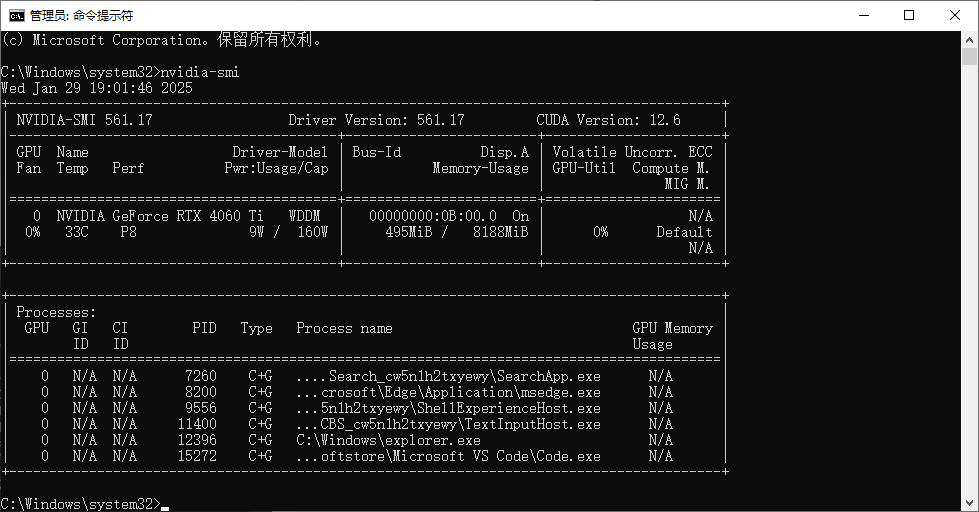
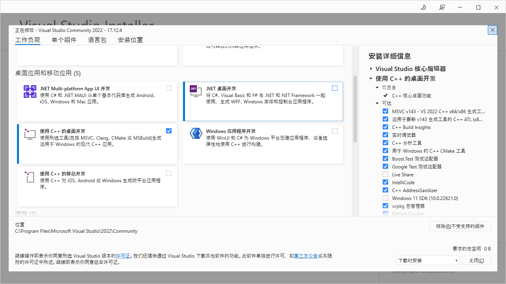
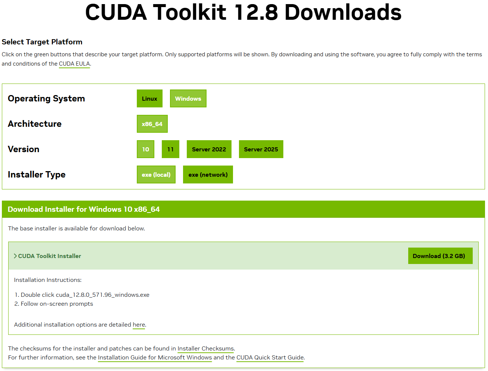
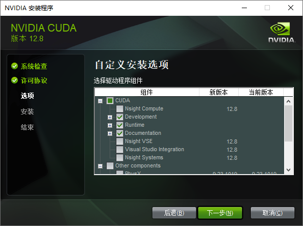
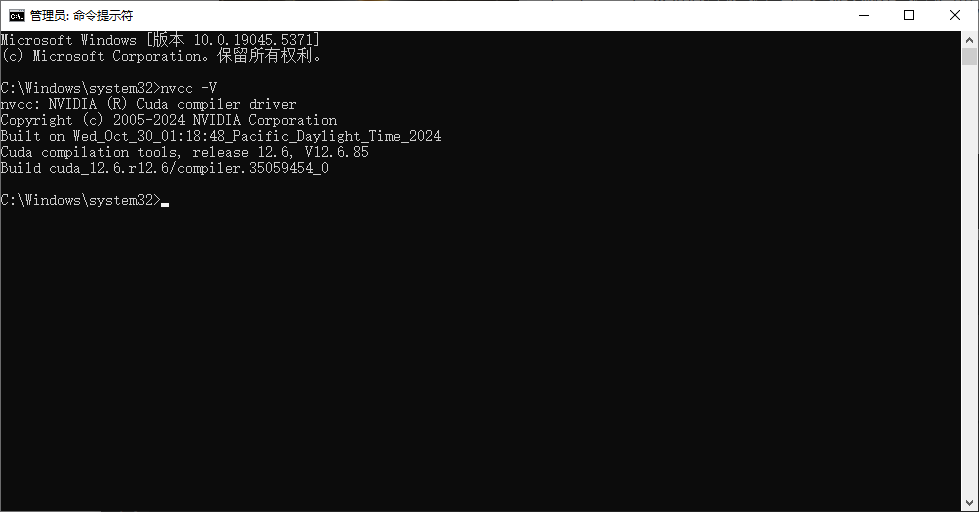
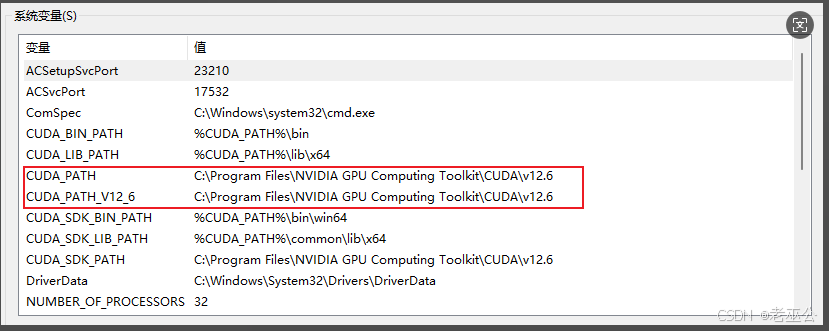
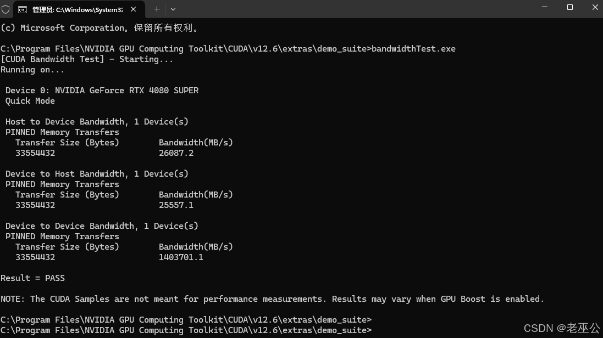
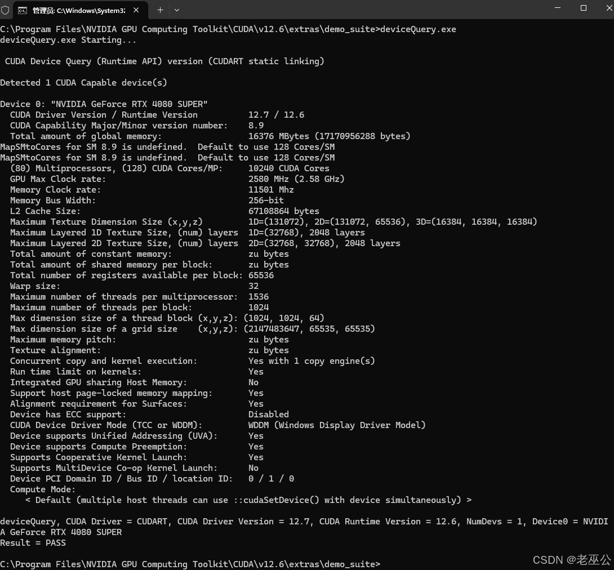
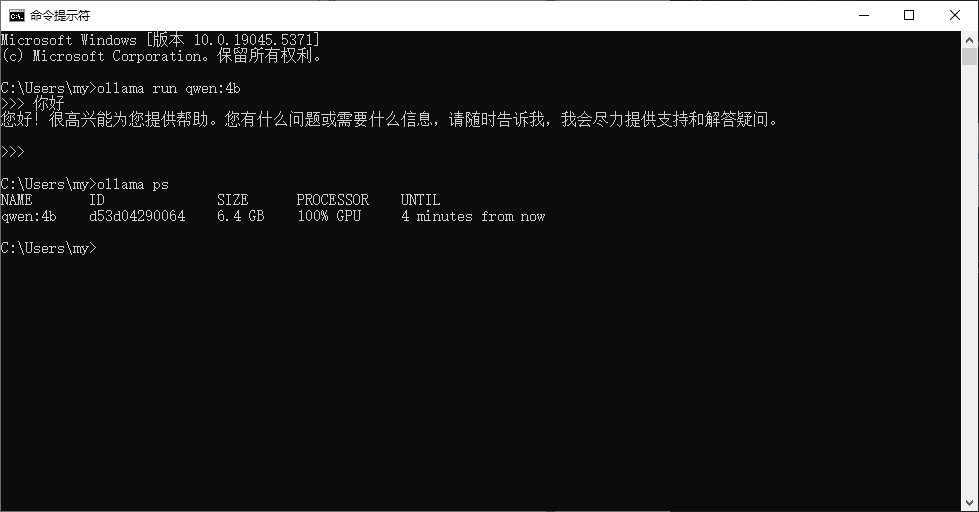

# Ollama使用GPU运行模型

1. 显示出当前GPU的所有基础信息
```shell
nvidia-smi
```


2. 安装[Visual Studio 2022](https://visualstudio.microsoft.com/zh-hans/downloads/)

> 选择使用C++ 的桌面开发



3. 安装[CUDA Toolkit](https://developer.nvidia.com/cuda-downloads)

> 先下载



> 选择自定义安装，`CUDA`子树勾选`Development`, `Runtime`, `Documentation`【`nvtx`，`nsight`开头的都可以不装】



```shell
# 查看cuda版本
nvcc -V
```


4. 环境变量，会自动配置好的，配置完记得重启



5. 验证，进入安装路径`C:\Program Files\NVIDIA GPU Computing Toolkit\CUDA\v12.6\extras\demo_suite`

> 输入`bandwidthTest.exe`提示`Result = PASS`



> 输入`deviceQuery.exe`提示`Result = PASS`



> 运行模型，并询问问题，然后输入`ollama ps`查看GPU使用率


